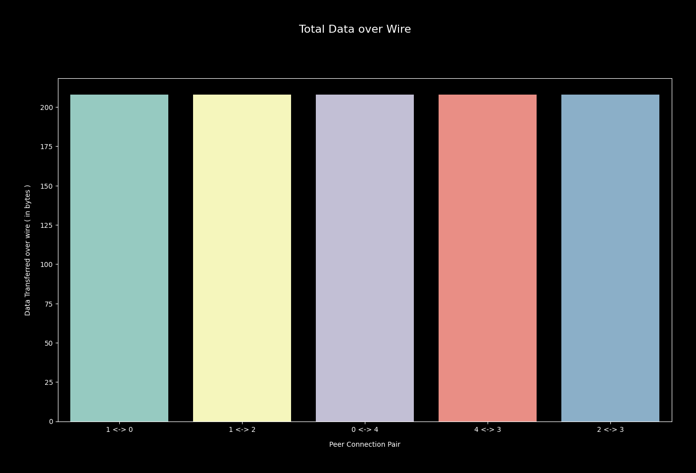
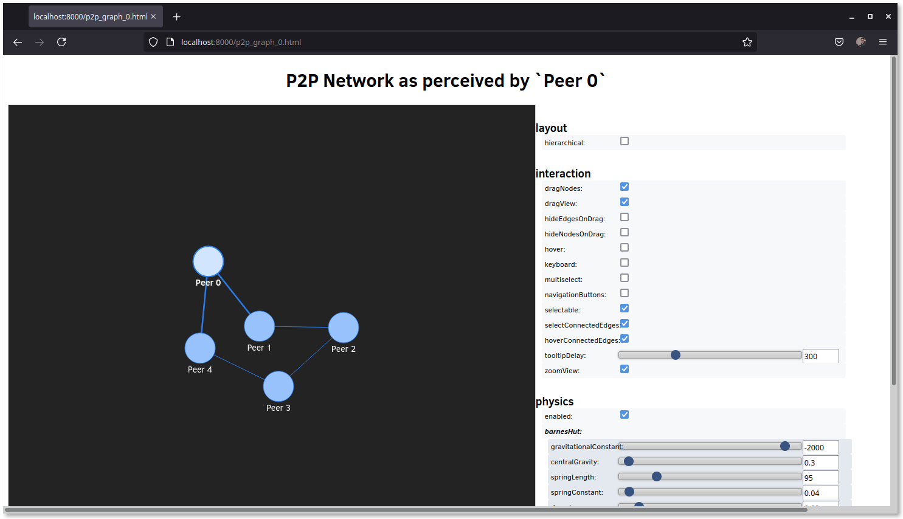
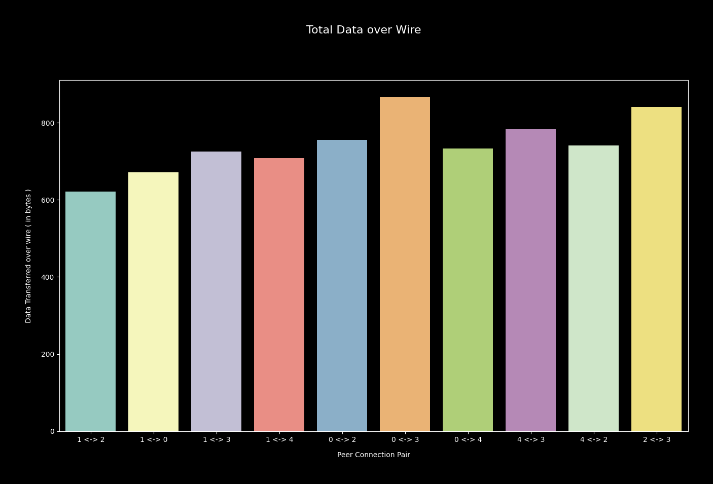
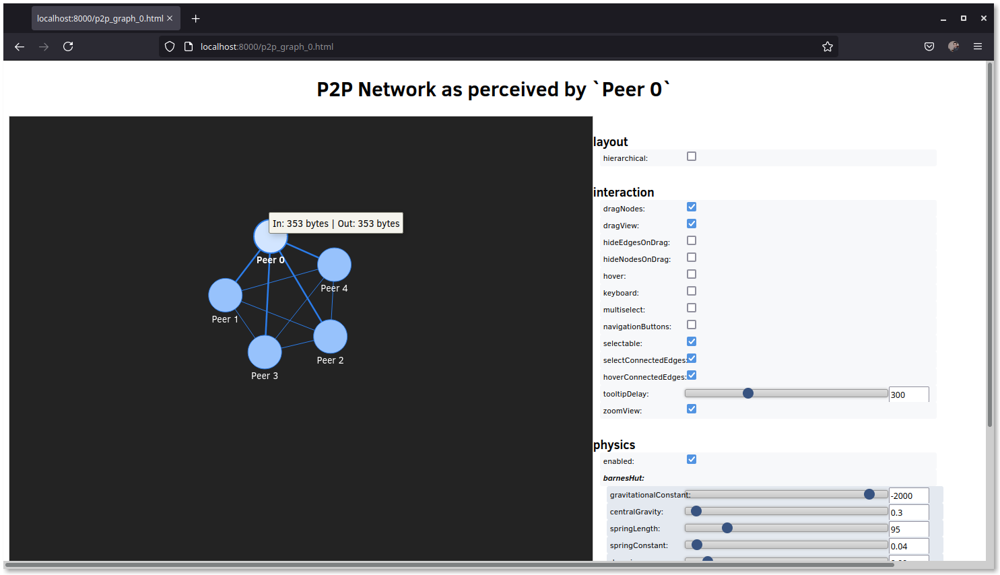

# p2p
Experimenting with P2P Network Topology 🧐

## Motivation

For implementing **crafted thought experiments** around P2P network topologies; collecting statistics; processing logs & visualising them, I create this repository.

## Description

### v1

Each network participant runs same state machine

```
begin:
    msg = author_own_message()
    propagate_to_peers(msg, :all)

    while(true):
        msg = receive_message()
        forward_to = inspect_header(msg)
        msg = append_hop(msg)
        propagate_to_peers(msg, forward_to)
    endwhile
end
```

where after each message is received from other peer, its header is inspected for absence of any possible **peer_id**(s). If found any, message is forwarded to those, while appending **self_id** in hop list.

### Topologies

Aforementioned algorithm is run on each peer participating in 3 differently crafted network topologies.

- **Cycle** : Circle shaped graph where each peer maintains TCP connection with other two immediate peers.
- **Mesh** : Complete graph network, where each peer maintains TCP connection with other _N-1_ peers, when network has _N_ participants.
- **Starfish** : Odd length cycle, where topology is crafted using following rule. Each peer maintains 2 TCP connections --- very similar to **Cycle**, just different sets of peers.

```
peer_1 = (self_id + 2) % N
peer_2 = (self_id + 3) % N
```

### Usage

- Run network with **cycle** topology --- collects required statistics in text format. By default it runs network with 5 peers.

```bash
make run_circle
```

- Visualise traffic over network edges ( in terms of bytes of data passed )

```bash
pushd v1/scripts
python3 -m venv venv
pip install -r requirements.txt
python traffic.py
```

- Output may look like




- Generate world view perceived by each peer

```bash
python p2p_graph.py
popd
```

- World view may look like for **Peer 0**



> Similarly for other peers, respective view to be generated by parsing message log & reconstructing network

- Other network topology simulations can be run similarly

```bash
make run_mesh # for mesh
make run_starfish # for star shaped network simulation
```

- After running visualiser scripts, for mesh traffic cost beared by network for running algorithm looks like



> Definitely expensive than **Cycle** !

- World view perceived by **Peer 0**


